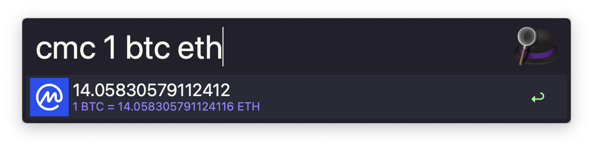

# Alfred CoinMarketCap

Alfred workflow for quick currencies conversion using [CoinMarketCap API](https://coinmarketcap.com/api).



## Pre-Requisites

- The [Deno](https://deno.land) runtime installed (`brew install deno`)
- The [CoinMarketCap API Key](https://coinmarketcap.com/api) (the free plan should be more than enough)

## Instalation

1. Download the `CoinMarketCap.alfredworkflow` file found on the [Releases](https://github.com/Gamote/alfred-cointmarketcap/releases) page.
2. Double click on the file and adjust the environment variables with your details
    ```
    API_KEY="YOUR_KEY"
    DEFAULT_CURRENCY="YOUR_USD"
    ```
3. Press `Import` and your good to go.

## How to use

- `cmc btc` - Convert 1 Bitcoin to the default currency. If no default currency was specified `USD` will be used
- `cmc btc eur` - Convert 1 Bitcoin to specified currency (`Euro` in this case)
- `cmc 1.5 btc eur` - Specify a specific amount to convert

For all the variants you can:
- Hit `↵` to copy the result to clipboard
- Hold `⌘` key and hit `↵` to open CoinMarketCap website on selected coin

## Credits

This repo is a [pawelgrzybek/alfred-cointmarketcap](https://github.com/pawelgrzybek/alfred-cointmarketcap) fork.
